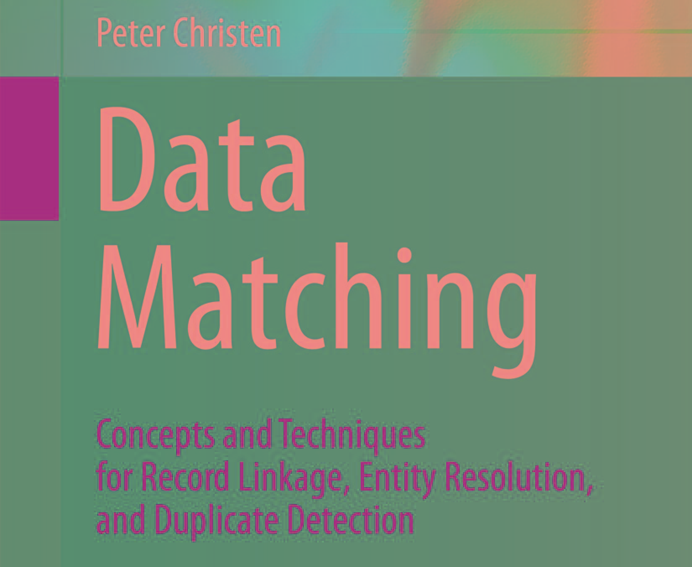
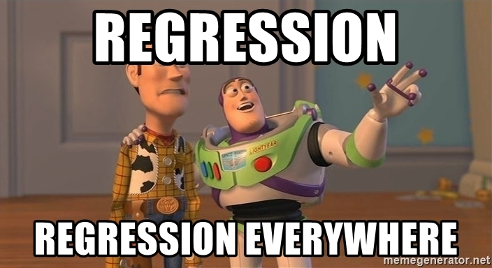
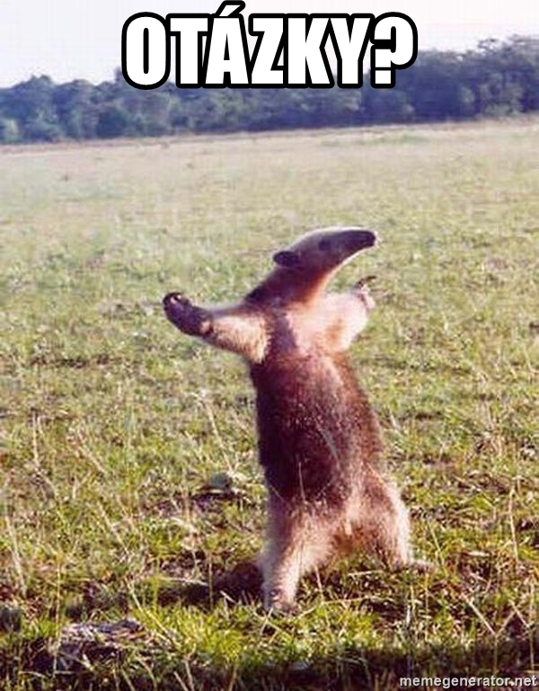

class: center, middle

```{r setup, include=FALSE}
options(htmltools.dir.version = FALSE)
```
 
# Jak se kandidáti přesunují mezi stranami a mezi úrovněmi politiky? 
# A proč?

---

## Kde jsme?

### horizontální mobilita 

typicky vysvětlení rozštěpení parlamentní strany

### vertikální mobilita

deskripce kariérních cest v jednotlivých zemích

---
class: center, middle

## Relevance?


---

## Sběr dat


---

## Sběr dat #2

```{r, message=FALSE, echo=FALSE, warning=FALSE  }
library(dplyr)
nasa <- readr::read_csv("nasa.csv")
nasa %>% slice(., c(109:118, 135:136)) %>% 
    select(person_id, data, first_name, 
           last_name, age, member_party, 
           nominate_party) %>%
    mutate(year = gsub("municipal_", "", data)) %>%
    select(-data) %>%
    knitr::kable(., format="html")
```

---

## Jak to budu dělat?



---

## Vertikální mobilita

### Individuální charakteristiky
(věk, gender, zkušenost ve volené funkci, úspěšnost na nižší úrovni)

### Změna strany

### Způsob selekce kandidátů v rámci strany

...

---

## Horizontální mobilita

### Individuální charakteristiky
(věk, gender, ... )

### Změna ideologické pozice strany 

### Změna volební podpory strany

...

---
class: center, middle, inverse




